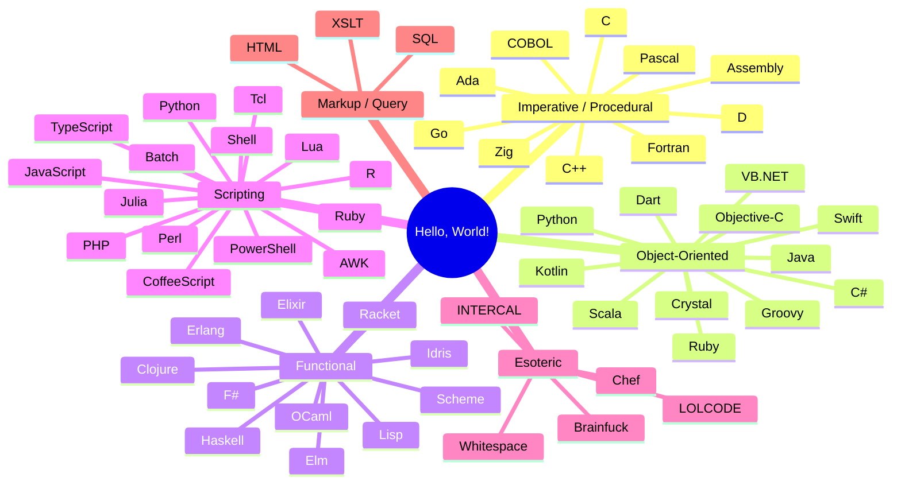

<!--
 Author: Quadstronaut
 Date: January 9, 2026
 Description: Hello World example for a repository.
-->

<div align="center">

# 👋 Hello, World! in Every Language

**65 languages. One greeting. Zero excuses not to learn something new.**

[](https://github.com/Quadstronaut/hello_world/commits/master)
[](https://github.com/Quadstronaut/hello_world)
[](https://github.com/Quadstronaut/hello_world)
[](https://github.com/Quadstronaut/hello_world)

---

[](#-language-table)
[](#-languages-by-paradigm)
[](#-getting-started)

</div>

---

## 📊 At a Glance

| Stat | Value |
| :--- | :--- |
| Total languages | **65** |
| Compiled languages | Ada, Assembly, C, C++, C#, Crystal, D, Elm, Erlang, F#, Fortran, Go, Haskell, Idris, Java, Kotlin, Nim, OCaml, Objective-C, Pascal, Rust, Scala, Swift, TypeScript, Vala, VB.NET |
| Interpreted languages | AWK, BASIC, Batch, Brainfuck, Chef, Clojure, CoffeeScript, Dart, Elixir, Forth, Groovy, Hack, HTML, INTERCAL, JavaScript, Julia, Lisp, LOLCODE, Lua, MATLAB, Perl, PHP, PowerShell, Prolog, Python, R, Racket, Ruby, Scheme, Shell, Smalltalk, SQL, Tcl, VBScript, Whitespace, XSLT, Zig |
| Esoteric / novelty | Brainfuck, Chef, INTERCAL, LOLCODE, Whitespace |
| Author | [Quadstronaut](https://github.com/Quadstronaut) |
| Started | January 9, 2026 |

---

## 🗺️ Languages by Paradigm



---

<a id="getting-started"></a>

## 🚀 Getting Started

> [!NOTE]
> You need the appropriate compiler, interpreter, or runtime environment installed for each language. The commands below are examples and may vary based on your system setup.

> [!TIP]
> Most languages have official installers. Check [repology.org](https://repology.org) for package availability across distros/OS, or use [asdf](https://asdf-vm.com) / [mise](https://mise.jdx.dev) for multi-runtime version management.

---

<a id="language-table"></a>

## 📋 Language Table

<details>
<summary><strong>A – G &nbsp;(Ada → Groovy) — click to expand</strong></summary>

| Language | File | Compilation / Run Command |
| :--- | :--- | :--- |
| Ada | `hello.adb` | `gnatmake hello.adb; ./hello` |
| Assembly (FASM/Win32) | `hello.asm` | `fasm hello.asm; ./hello.exe` |
| AWK | `hello.awk` | `awk -f hello.awk` |
| BASIC | `hello.bas` | `(Requires a BASIC interpreter, e.g., QB64)` |
| Batch (Windows) | `hello.bat` | `.\hello.bat` |
| Brainfuck | `hello.bf` | `(Requires a Brainfuck interpreter)` |
| C | `hello.c` | `gcc hello.c -o hello_c.exe; .\hello_c.exe` |
| C++ | `hello.cpp` | `g++ hello.cpp -o hello_cpp.exe; .\hello_cpp.exe` |
| C# | `hello.cs` | `csc hello.cs; .\hello.exe` |
| Chef | `hello.chef` | `(Requires a Chef interpreter)` |
| Clojure | `hello.clj` | `clj hello.clj` |
| COBOL | `hello.cob` | `cobc -x -o hello.exe hello.cob; .\hello.exe` |
| CoffeeScript | `hello.coffee` | `coffee hello.coffee` |
| Crystal | `hello.cr` | `crystal run hello.cr` |
| D | `hello.d` | `dmd hello.d; .\hello.exe` |
| Dart | `hello.dart` | `dart hello.dart` |
| Elixir | `hello.exs` | `elixir hello.exs` |
| Elm | `hello.elm` | `elm make hello.elm` |
| Erlang | `hello.erl` | `erlc hello.erl; erl -noshell -s hello start -s init stop` |
| F# | `hello.fs` | `fsc hello.fs; .\hello.exe` |
| Forth | `hello.fth` | `gforth hello.fth` |
| Fortran | `hello.f90` | `gfortran hello.f90 -o hello_f90.exe; .\hello_f90.exe` |
| Go | `hello.go` | `go run hello.go` |
| Groovy | `hello.groovy` | `groovy hello.groovy` |

</details>

<details>
<summary><strong>H – N &nbsp;(Hack → Nim) — click to expand</strong></summary>

| Language | File | Compilation / Run Command |
| :--- | :--- | :--- |
| Hack | `hello.hack` | `hhvm hello.hack` |
| Haskell | `hello.hs` | `runghc hello.hs` |
| HTML | `hello.html` | `(Open in a web browser)` |
| Idris | `hello.idr` | `idris hello.idr -o hello_idr; ./hello_idr` |
| INTERCAL | `hello.i` | `(Requires an INTERCAL compiler)` |
| Java | `hello.java` | `javac hello.java; java Hello` (Note: class name is `Hello`) |
| JavaScript | `hello.js` | `node hello.js` |
| Julia | `hello.jl` | `julia hello.jl` |
| Kotlin | `Hello.kt` | `kotlinc Hello.kt -include-runtime -d hello.jar; java -jar hello.jar` |
| Lisp (Common Lisp) | `hello.lisp` | `sbcl --script hello.lisp` |
| LOLCODE | `hello.lol` | `lci hello.lol` |
| Lua | `hello.lua` | `lua hello.lua` |
| MATLAB | `hello_matlab.m` | `(Run in MATLAB environment)` |
| Nim | `hello.nim` | `nim compile --run hello.nim` |

</details>

<details>
<summary><strong>O – Z &nbsp;(OCaml → Zig) — click to expand</strong></summary>

| Language | File | Compilation / Run Command |
| :--- | :--- | :--- |
| OCaml | `hello.ml` | `ocaml hello.ml` |
| Objective-C | `hello.m` | `gcc -o hello_objc.exe hello.m -lobjc -lgnustep-base` (using GNUStep) |
| Pascal | `hello.pas` | `fpc hello.pas -ohello_pas.exe; .\hello_pas.exe` |
| Perl | `hello.pl` | `perl hello.pl` |
| PHP | `hello.php` | `php hello.php` |
| PowerShell | `hello.ps1` | `pwsh -File .\hello.ps1` |
| Prolog | `hello.pro` | `swipl -s hello.pro -g main -t halt.` |
| Python | `hello.py` | `python hello.py` |
| R | `hello.R` | `Rscript hello.R` |
| Racket | `hello.rkt` | `racket hello.rkt` |
| Ruby | `hello.rb` | `ruby hello.rb` |
| Rust | `hello.rs` | `rustc hello.rs; .\hello.exe` |
| Scala | `hello.scala` | `scalac hello.scala; scala HelloWorld` |
| Scheme | `hello.scm` | `(Requires a Scheme interpreter, e.g., Guile, Chicken)` |
| Shell (Bash) | `hello.sh` | `bash hello.sh` |
| Smalltalk | `hello.st` | `(Requires a Smalltalk environment, e.g., Gnu Smalltalk, Pharo)` |
| SQL | `hello.sql` | `(Run in any SQL client, e.g., sqlite3, psql)` |
| Swift | `hello.swift` | `swift hello.swift` |
| Tcl | `hello.tcl` | `tclsh hello.tcl` |
| TypeScript | `hello.ts` | `tsc hello.ts; node hello.js` |
| Vala | `hello.vala` | `valac hello.vala; .\hello.exe` |
| VB.NET | `hello.vb` | `vbc hello.vb; .\hello.exe` |
| VBScript | `hello.vbs` | `cscript hello.vbs` |
| Whitespace | `hello.ws` | `(Requires a Whitespace interpreter)` |
| XSLT | `hello.xslt` | `(Requires an XSLT processor like xsltproc)` |
| Zig | `hello.zig` | `zig run hello.zig` |

</details>

---

## 💡 Quick Samples

<details>
<summary><strong>Compiled classics — C, Rust, Go</strong></summary>

```c
// hello.c
#include <stdio.h>
int main() {
    printf("Hello, World!\n");
    return 0;
}
```

```rust
// hello.rs
fn main() {
    println!("Hello, World!");
}
```

```go
// hello.go
package main
import "fmt"
func main() {
    fmt.Println("Hello, World!")
}
```

</details>

<details>
<summary><strong>Esoteric highlights — Brainfuck, LOLCODE, Whitespace</strong></summary>

```brainfuck
// hello.bf — Brainfuck
++++++++++[>+++++++>++++++++++>+++>+<<<<-]>++.>+.+++++++..+++.>++.<<+++++++++++++++.>.+++.------.--------.>+.>.
```

```lolcode
// hello.lol — LOLCODE
HAI 1.2
  VISIBLE "Hello, World!"
KTHXBYE
```

> [!NOTE]
> The Whitespace program (`hello.ws`) is invisible by design — it encodes instructions in spaces, tabs, and newlines only. Open the raw file in a hex editor to appreciate it.

</details>

<details>
<summary><strong>Functional flavors — Haskell, Elixir, OCaml</strong></summary>

```haskell
-- hello.hs
main :: IO ()
main = putStrLn "Hello, World!"
```

```elixir
# hello.exs
IO.puts "Hello, World!"
```

```ocaml
(* hello.ml *)
print_endline "Hello, World!"
```

</details>

---

> [!IMPORTANT]
> Each source file is self-contained — open any `hello.*` at the repo root to see the full implementation. Commands above target Windows paths (`.exe`, `.\`) where applicable; adjust for Linux/macOS.

---

<div align="center">

Made with ☕ and curiosity by [Quadstronaut](https://github.com/Quadstronaut)

</div>
